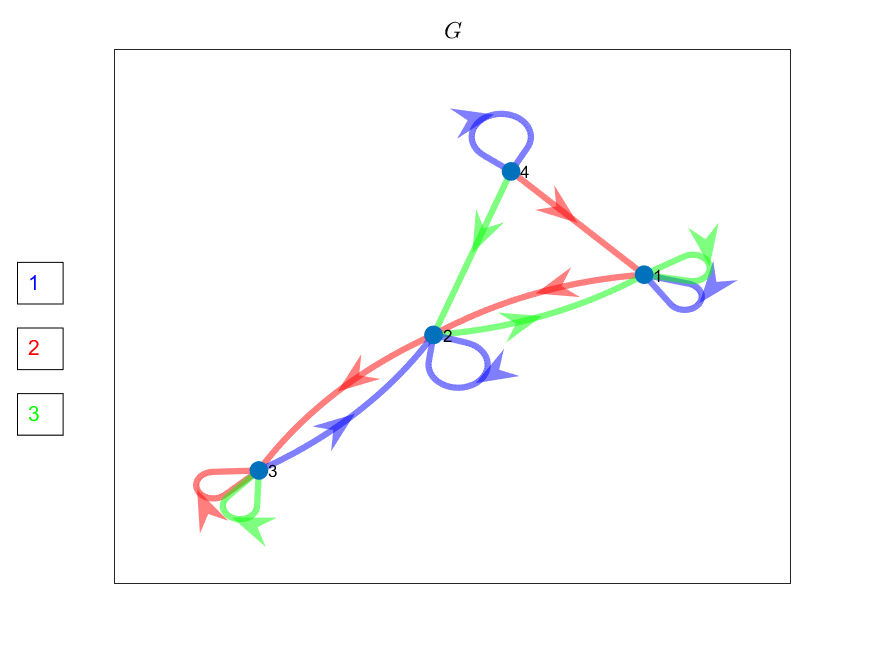
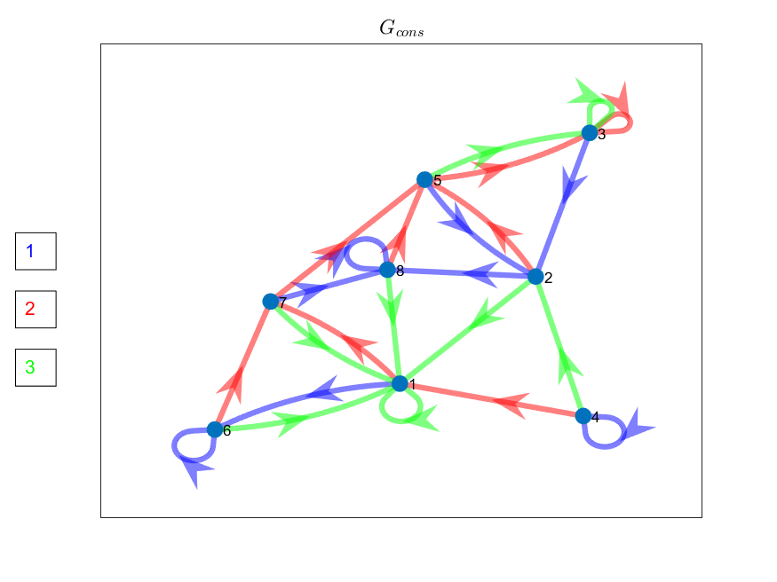
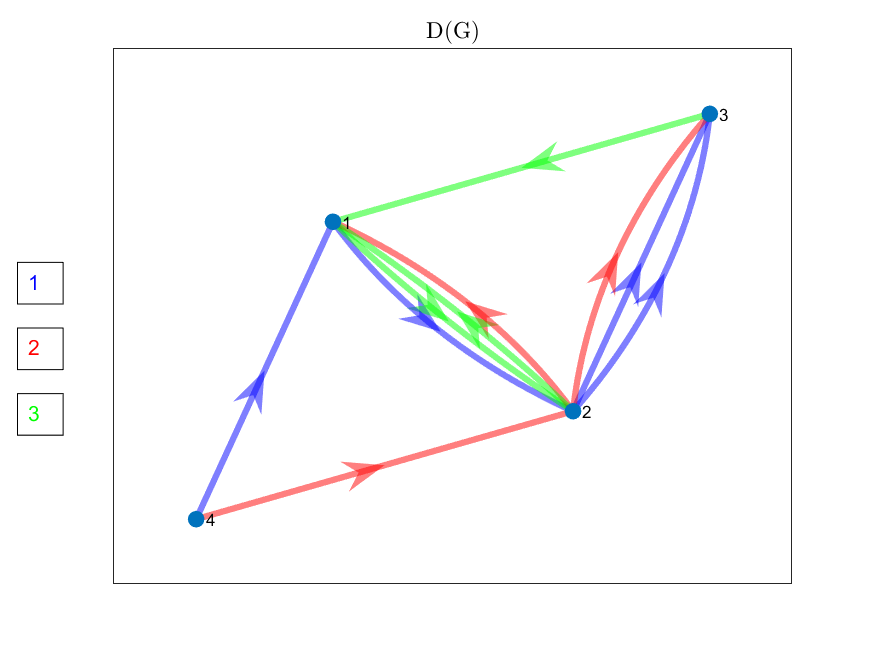
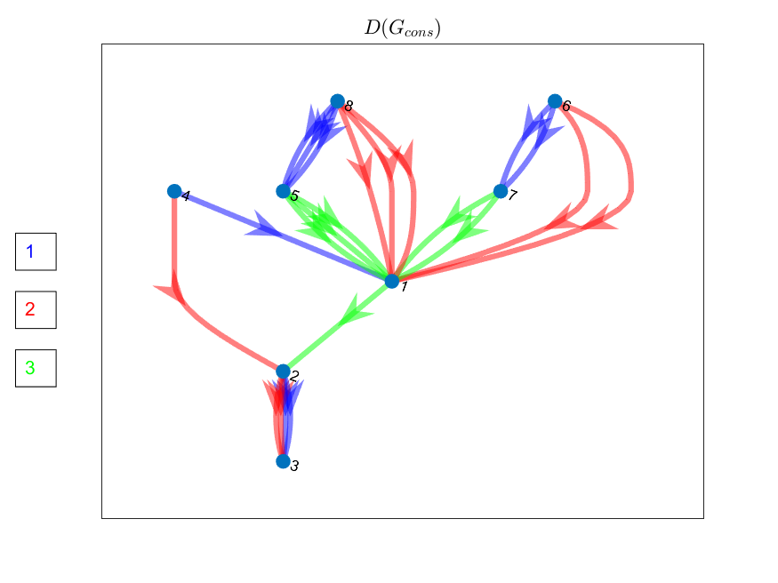
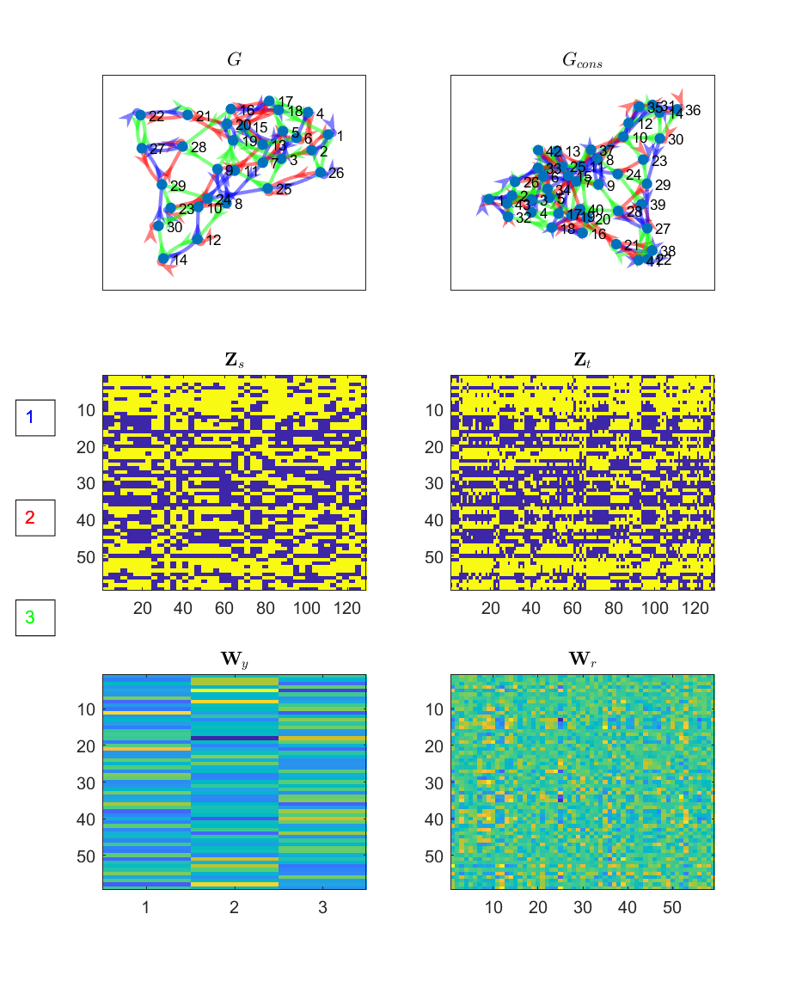

# gFTP

MATLAB implementation of the generalised Firing-to-Parameter algorithm (gFTP) introduced in "Constructing neural networks with pre-specified dynamics".  

Function gFTP.m takes as input a structure array named "data" with fields: G (the transition graph in matrix format), mode ('consistency' or 'construction') and N_neu_min.
It returns G_cons, matrices Z_s, Z_t, W_y, W_r, and structure array data_out, with the time spend constructing G_cons and constructing the activation and synaptic weight matrices.

## An example
First, we construct a graph $G$ by defining its associated matrix $\mathbf{G}$
```Matlab
G = [1 1 1
     2 1 2
     3 1 1
     1 2 2
     2 2 3
     3 2 1
     1 3 2
     2 3 3
     3 3 3
     1 4 4
     2 4 1
     3 4 2];
```
We plot the graph with the tgPlot function:
```Matlab
tgPlot(G);
title('$G$','interpreter','latex')
```



Next, we construct the input structure data_in. We will pass this structure as input argument to gFTP
```Matlab
data_in.G = G;
data_in.mode = 'construction';     %to construct the network; use 'consistency' to only generate $G_{cons}$
data_in.N_neu_min = [];            %no minimum number of neurons imposed
```
Call gFTP
```Matlab
[G_cons, Y, Z_s, Z_t, W_y, W_r, data_out] = gFTP(data_in);
```
Check if the output network actually follows graph G_cons
```Matlab
is_isomorf = check_dynamics(G_cons,Y',Z_s',Z_t')

is_isomorf =

  logical

   1
```
Check consistency and construction times in data_out
```Matlab
data_out

data_out = 

  struct with fields:

       consistency_time: 0.2358
      construction_time: 0.5145
    perceptron_training: 1
```

Plot consistent graph G_cons
```Matlab
tgPlot(G_cons)
title('$G_{cons}$','interpreter','latex')
```


Construct and plot auxiliary graph D with function make_D and plot_D
```Matlab
D = make_D(G);
D_cons = make_D(G_cons);
plot_D(D);
title('D(G)','interpreter','latex')
plot_D(D_cons);
title('$D(G_{cons})$','interpreter','latex')
```



## Testing with random transition graphs
We call function make_rand_G to generate a random graph with 30 nodes and 3 stimuli
```Matlab
N_s = 3;
N_v = 30;
G = make_rand_G(N_s, N_v);
```
Call gFTP and plot G_cons and matrices Z_s, Z_t, W_y, W_r
```Matlab
[G_cons, Y, Z_s, Z_t, W_y, W_r, data_out] = gFTP(data_in);
is_isomorf = check_dynamics(G_cons,Y',Z_s',Z_t')
figure
subplot(3,2,1)
tgPlot(G)
title('$G$','interpreter','latex')

subplot(3,2,2)
tgPlot(G_cons)
title('$G_{cons}$','interpreter','latex')

subplot(3,2,3)
imagesc(Z_s)
title('$\mathbf{Z}_s$','interpreter','latex')

subplot(3,2,4)
imagesc(Z_t)
title('$\mathbf{Z}_t$','interpreter','latex')

subplot(3,2,5)
imagesc(W_y)
title('$\mathbf{W}_y$','interpreter','latex')

subplot(3,2,6)
imagesc(W_r)
title('$\mathbf{W}_r$','interpreter','latex')
```

